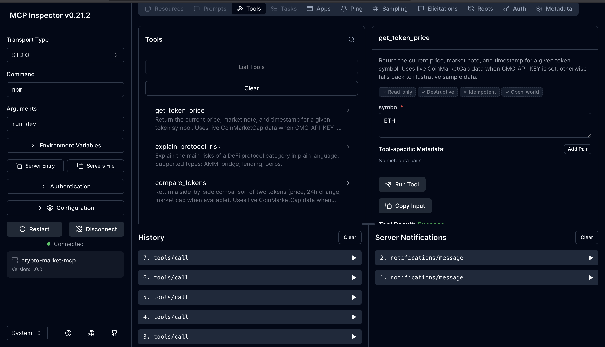
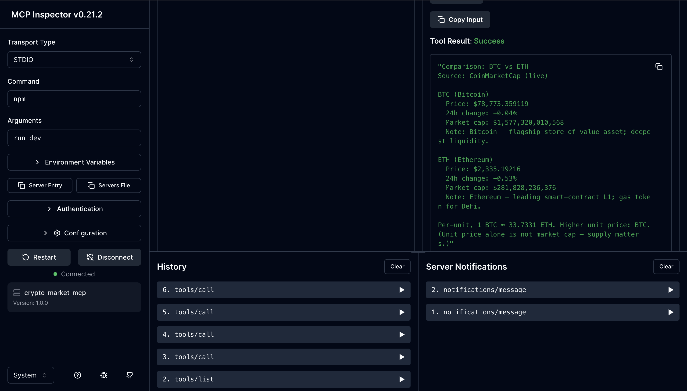

# crypto-market-mcp

A small MCP (Model Context Protocol) server that exposes three crypto-market tools over stdio. Live prices come from the CoinMarketCap API; if no API key is set, the server falls back to illustrative sample data so it still runs.

## Tools

| Name                    | Input                              | Output                                                                 |
| ----------------------- | ---------------------------------- | ---------------------------------------------------------------------- |
| `get_token_price`       | `symbol` (e.g. `BTC`)              | Price, 24h change, market cap, market note, source, timestamp.         |
| `explain_protocol_risk` | `protocol_type` (`AMM` / `bridge` / `lending` / `perps`) | Plain-language risk overview for that DeFi category.                   |
| `compare_tokens`        | `token_a`, `token_b`               | Side-by-side: price, 24h change, market cap, per-unit ratio, richer.   |

`explain_protocol_risk` is fully static. The two price tools call CoinMarketCap when `CMC_API_KEY` is present, otherwise they fall back to bundled sample data.

## Project layout

```
src/
  index.ts                       — bootstrap: create server, register tools, connect stdio
  cmc.ts                         — CoinMarketCap client + LiveQuote type
  data.ts                        — SAMPLE_PRICES + PROTOCOL_RISKS
  tools/
    getTokenPrice.ts             — registerGetTokenPrice(server)
    explainProtocolRisk.ts       — registerExplainProtocolRisk(server)
    compareTokens.ts             — registerCompareTokens(server)
```

Adding a 4th tool: drop a file in `src/tools/`, then add one import + one `register…(server)` call in `src/index.ts`.

## Setup

```bash
npm install
```

Create a `.env` file at the project root with your CoinMarketCap key (free tier is fine):

```
CMC_API_KEY=your_key_here
```

`.env` is gitignored. Get a key at https://coinmarketcap.com/api/.

## Running

```bash
npm run dev      # tsx + .env, hot-reloadable source
npm run build    # tsc → dist/
npm start        # node + .env on the built output
```

When the server is running you should see exactly one line on stderr:

```
crypto-market-mcp server running on stdio
```

It then waits for JSON-RPC messages on stdin — that is normal. To exercise the tools you need a client.

## Testing with the MCP Inspector

The fastest way to poke at the tools without setting up a real client:

```bash
npx @modelcontextprotocol/inspector tsx --env-file=.env src/index.ts
```

Open the URL it prints (e.g. `http://localhost:6274/?MCP_PROXY_AUTH_TOKEN=…`). You'll see all three tools listed:



Pick a tool, fill in the input, hit **Run Tool**. Live result from `compare_tokens(BTC, ETH)`:



> Tip: invoke the server directly with `tsx`, not via `npm run dev` — `npm`'s wrapper output can pollute stdout and break the JSON-RPC framing the Inspector expects.

## Manual stdio test (no client)

```bash
echo '{"jsonrpc":"2.0","id":1,"method":"initialize","params":{"protocolVersion":"2024-11-05","capabilities":{},"clientInfo":{"name":"t","version":"1"}}}
{"jsonrpc":"2.0","method":"notifications/initialized"}
{"jsonrpc":"2.0","id":2,"method":"tools/call","params":{"name":"get_token_price","arguments":{"symbol":"BTC"}}}' | npx tsx --env-file=.env src/index.ts
```

You should see the live BTC quote come back as JSON.

## Next: Claude Desktop

To use this server inside Claude Desktop, add an entry to `~/Library/Application Support/Claude/claude_desktop_config.json`:

```json
{
  "mcpServers": {
    "crypto-market": {
      "command": "npx",
      "args": ["tsx", "--env-file=.env", "src/index.ts"],
      "cwd": "/Users/mahimathacker/crypto-market-mcp"
    }
  }
}
```

Restart Claude Desktop, then ask it something like *"Use the crypto-market server to get the current ETH price."*

## License

ISC
